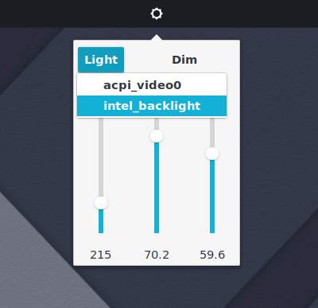
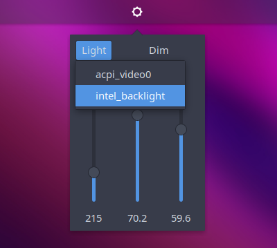

# Brightness Controller 

<br/>  

Brightness Controller is a Budgie Desktop applet for productivity.

<br/>
<br/>  


Evo Pop                    |  Arc Design
:-------------------------:|:-------------------------:
  |  

<br/>

# Dependencies
```
gnome-settings-daemon >= 3.32.0
xrandr >= 1.5.0
budgie-1.0 >= 2
gtk+-3.0
vala
```

<br/>


Install from source code:

```bash
# Uninstall old version.
# Clone from github
# Move into budgie-extras dir
  cd  budgie-extras
# Build  
  meson --buildtype plain -Dbuild-all=false -Dbuild-brightness-controller=true --prefix=/usr --libdir=/usr/lib --datadir=/usr/share ..
# Compile
  ninja -v
# Install  
  sudo ninja install
# Restart laptop or logout-login or replace budgie desktop 
  budgie-panel --replace & 
# or without terminal output  
  nohup budgie-panel --reset --replace &
# Add Brightness Controller to your panel from Budgie Desktop Settings   
```
<br/>

# Usage

The Gnome Settings Daemon's color plugin causes some unexpected brightness changes when resuming from suspend or copying and pasting a folder etc. 
To avoid this you can remove the Gnome Settings Daemon's color plugin from autostart. 
To do this you can find a checkbox  in the Budgie Desktop Settings app under Advanced Brightness Controller applet settings.

<br/>

# Development Cheatsheet

[How to hack the budgie desktop on ubuntu](https://discourse.ubuntubudgie.org/t/how-to-hack-the-budgie-desktop-on-ubuntu/574)

<br/>

```bash
# Check Source code checkbox
software-properties-gtk

# Install dependencies
sudo apt update &&
sudo apt install meson &&
sudo apt install valac &&
sudo apt install intltool &&
sudo apt install libgtk-3-dev &&
sudo apt install devscripts &&
sudo apt install budgie-core-dev &&
sudo apt build-dep budgie-desktop
```
<br/>

# References

[Ubuntu Budgie](https://ubuntubudgie.org/)
<br/>
[UbuntuBudgie/budgie-extras](https://github.com/UbuntuBudgie/budgie-extras)
<br/>
[budgie-desktop/budgie-desktop-examples](https://github.com/budgie-desktop/budgie-desktop-examples/tree/master/python_project)
<br/>
[LordAmit/Brightness](https://github.com/LordAmit/Brightness)
<br/>
[ilgarmehmetali/budgie-brightness-control-applet](https://github.com/ilgarmehmetali/budgie-brightness-control-applet)
<br/>
[dgaw/budgie-workspaces-compact](https://github.com/dgaw/budgie-workspaces-compact)

<br/>

# License

This program is free software; you can redistribute it and/or modify it under the terms of the GNU General Public License as published by the Free Software Foundation; either version 3 of the License, or at your option) any later version.
